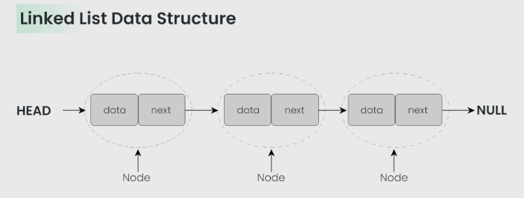
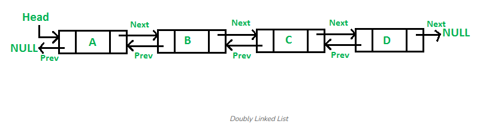
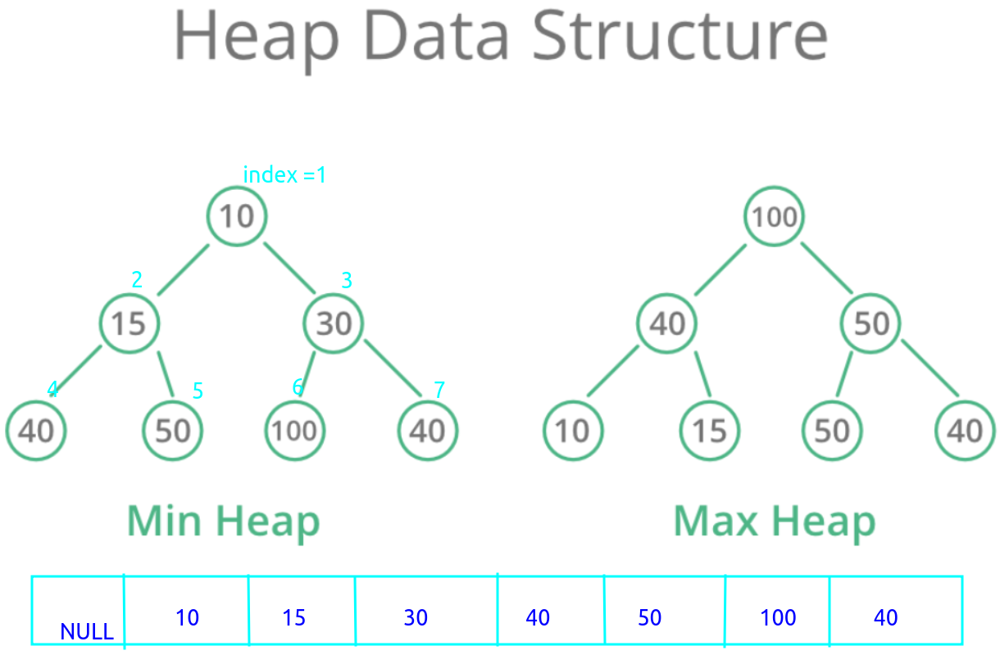
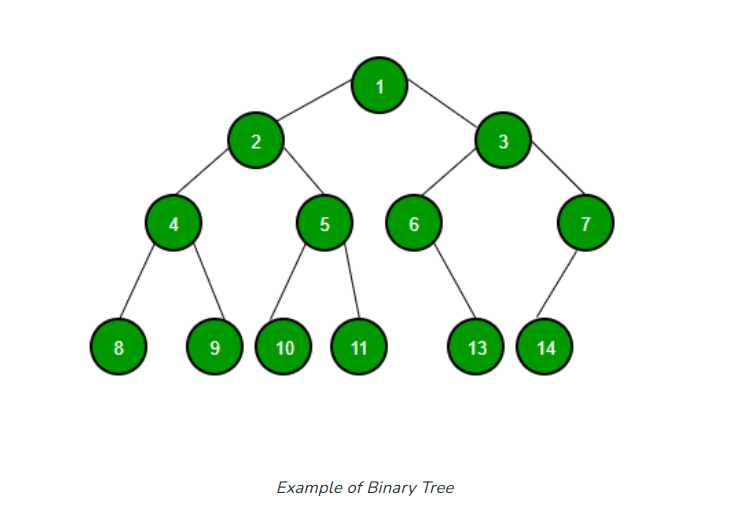

# 数据结构与算法

## Data Structure

### Stack

栈结构是一种连续的内存，stack pointer 从高地址位开始，每入栈一个数据sp向低位移动数据内存长度的字节，如果栈容量按照一个数据内存长度作为单位，那么入栈一个数据，栈容量减一。当count为0时栈满，sp位于栈内存最低位。

栈的设计结构中，内存地址连续，栈指针从最高地址开始，所以进栈相当于站指针下移，出栈相当于栈指针上移，新入栈的数据总是位于站指针的上方(假设高内存地址在上，0内存地址在下)，因此出栈过程中，我们只需要将指针向高位移动（上移），因此最先入栈的数据也最先出栈。

### Queue

#### forward_list

* 单向链表，只能从队尾入队，从队首出队。

* methods
  * push
    * push_end：只允许在数据末尾增加节点，复杂度O(1)
  * ~~insert~~
  * pop
    * pop_front：只允许从链表头删除节点，复杂度O(1)
* 序列实现
  * 如果是使用Array实现单向链表，这样的单向链表支持random access，还支持O(1)下标访问，在任一节点可以随意前后移动，缺点是在列表初始化的时候就固定了大小，扩容操作复杂度高需要O(n)数据拷贝，所以我认为这种实现方式已经不算是一个单向链表，缺失了链表的基本特性--随意扩容，这种实现方式最多算是对Array的数据读写、删除的一种限制。
* 链式实现
  * 链式实现方式，是native的实现方式。保留了链表原本的特性，可以无限的在链表尾部增加节点，同样继承了链表的一些缺陷，查找数据需要从Head端开始逐个遍历，为了提升append的速度，一般在实现过程中会用Tail保存最后一个节点，用于直接添加新的节点。

#### deque（double-end queue）

* 双端链表，允许从链表两端添加、删除节点。链式存储的双端链表具有Stack和queue两者的方法。所以在有一些实现上，都是以deque作为底层数据结构，然后再对其方法进行封装。双端队列的应用有很多，浏览器页面访问记录（访问当期页面的前一个页面或者后一个页面）、用于任务调度算法等等。

* methods

  * push
    * push_front：在链表头插入节点 O(1)
    * push_end：在链表尾部插入节点 O(1)

  * pop
    * pop_front：删除头部节点 O(1)
    * pop_end：删除尾部节点O(1)

#### list(double linked list)

* 双向链表，每个节点有需要三块内存区域，第一块用与保存前向节点地址，第二块用作当前节点的数据存储，第三块用于保存后一个节点地址。这种数据结构支持在任一位置删除或插入节点，用于保存数据不稳定需要
* 
* methods
  * push
  * insert：支持在任意位置插入数据 O(1)
  * delete：删除任意位置节点 O(1)

* 双向链表相比与单向链表在使用上更具有灵活性，对于不确定长度的数据保存和删除都非常方便，唯一的缺点就是占用内存空间较大，在很多嵌入式设备会使用单向链表封装成双向链表使用以节约内存。

### Heap

* Binary Heap
  * 二叉堆是一种基于完全二叉树的数据结构，但在数据存储方面，底层的数据容器使用的是序列容器，只要支持索引访问的序列容器都是可以的。最小二叉堆在数据结构上要求每个子树的根节点大于子节点，那么最高的根节点就是所有数据中最小值。由于二叉堆是二叉树的结构，因此插入、删除操作复杂度都为log(n)。
  * 由于二叉堆的底层容器使用的序列容器，所以二叉堆的所有子树都满足计算公式：
    * 根节点索引为i 
    * 左子树的索引为2*i 
    * 右子树的索引为2*i+1
    * 为了方便计算最高的根节点从1开始计算。（从0也是可以的只是每次需要偏移比较麻烦）
  * 插入新节点：首先，堆数据末尾（序列容器最后端）添加新节点，然后将新节点进行“上浮”操作，在一个最小二叉堆中，上浮操作的循环条件为如果根节点的值大于新节点的值，那么上浮（交换两节点位置），直到遇到小于根节点的值停止上浮。
  * 删除节点：如果删除一个节点，每次只允许删除最高根节点（Min Heap is always delete the minimum of the tree）并且用最后一个叶子节点替换这个节点的位置（latest leaf node of the tree），然后开始执行“下移”操作。在一个最小二叉堆中，下移操作需要将新移动上来的节点沿着较大的子节点路径的方向进行向下移动（为什么要和最大的子节点交换，因为在最小堆中要求根节点一定是大于子节点的，所以与较大的子节点交换维护了最小二插队的堆结构）。

### Hash

* map

### Tree

#### Binary Tree

* 
* 二叉树，每个节点最多包含两个子节点的树结构。

#### Binary Search Tree

* 二叉查找树是一种有序的二叉树，二叉查找树要求在数据插入的时候要保持数据的分布为：左子树<根节点<右子树。当我们在一组无序的数据中进行数据项搜索时，我们需要一一比对搜索复杂度为O(n)，在有序数据中就可以使用二分查找来提升数据的检索速度。二叉查找树就是为了加速数据的检索，由于数据的保存为二叉树的结构所以二叉查找树检索数据的复杂度为O(logn)。树的结构也有利于增加和删除节点。

* methods

  * put

    * 如果往一个空的二叉查找树上放置节点，直接放置即可。
    * 放置一个新的节点到二叉查找树中，是一个递归检索放置位置的过程，要从根节点开始向下检索，如果放置的值大于当前节点，则往当前节点的右子树上放置，如果右子树已经存在了节点，那么将当前根节点指向右子树，再进行数值判断选取放置的位置，直到遇到需要放置的位置没有节点就完成放置过程。

  * delete 删除一个节点纯在三种情况

    * 删除的节点是一个叶子节点：叶子节点直接删除

    * 删除的节点是只包含一个子节点

      * 被删除的节点包含一个子节点，那么被删掉的节点的子节点需要被删除节点的父节点继承。

        * if currentNode.parent.left == current , then currentNode->parent->left = currentNode->child(left/right)
        * if currentNode.parent.right == current, then currentNode->parent->right = currentNode->child(left/right)

        > 不需要担心悲删除节点的子节点直接替换了被删除节点在父节点上指向的位置，因为你替换上来的就是被删除节点的子节点，二叉查找树的插入算法保证了任意一个根节点的左子树下的所有节点都是小于根节点的，右子树是大于根节点的。因此可以直接被删除节点的子树可以直接顶替被删除节点的位置。

    * 删除的节点包含两个子节点

      1. findSuccessor 找到删除节点的替换节点
         1. 查找替换节点：以删除节点的右子树作为根节点，在根节点的左子树上寻找最小值的节点（因为是在寻找最小值，所以被寻找到的这个节点一定没有左子树，但可以有右子树）
         2. splice如果寻找到的替换节点存在右子树，将右子树接替要替换的节点的位置

      2. replace用找到的节点替换将被删除的节点

#### AVL Tree

* 二叉平衡树就是在每个节点上增加了一个平衡因子。平衡因子初始化为0，如果左子树增加则+1，如果右子树增加则减一。每次新插入一个数据都会从插入节点开始递归的向上调整并检索父节点的平衡因子。如果发现任一节点的平衡因子的绝对值大于1说明当前二叉树已经不平衡了，就需要调用rebalace函数在当前节点进行平衡调整。向上检索过程如果遇到某个调整后的节点的平衡因子为0则停止继续向上检索，否则直至到根节点为止。
* methods
  * put
    * 每增加一个节点调用更新一次节点平衡因子函数，从当前向上更新当前节点的所有父节点，直到更新到某个父节点的平衡因子为0时停止，否则直至更新至最高根节点停止更新。
    * 如果发现某个节点在更新后平衡因子的绝对值大于1，说明该节点下的子节点已经不再保持平衡状态，需要旋转当前节点使当前节点下的子节点保持平衡
      * 如果当前节点<1，说明当前节点右重，需要进行左旋
      * 如果当前节点>1，说明当前节点左重，需要进行右旋
      * 为了使旋转后的节点保持平衡，还需在旋转前判断
        * 如果进行左旋，需要判断当前旋转节点的右节点是否左重，如果左重，要对该右节点进行右旋后再进行上面提到的左旋。
        * 如果进行右旋，需要判断当前旋转节点的左节点是否右重，如果右重，要对该左节点进行左旋后在进行右旋。
      * 左旋就是将当前节点作为旋转节点，将旋转节点的右子树替换当前旋转节点的位置，如果右子树存在左子树，需要将新节点的左子树放置到旋转节点的右子树上（为什么可以放在右子树上？右子树一定有空位吗？是的。因为新节点就是旋转节点的右子树，如果新节点提升为旋转节点的父节点，切旋转节点成为新节点的左子树，那么旋转节点的右子树一定是空闲的。）
      * 右旋就是将当前节点作为旋转节点，将旋转节点的左子树（新节点）替换当前旋转节点的位置，新节点的右子树将指向旋转节点。如果新节点已经存在右子树，那么需要将新节点原来的右子树放置到旋转节点的左子树位置。

## Algorithm

### Search

#### Linear search

#### [Binary Search](./projects/binarySearch.cpp)

### Sort

#### [bubble sort](./projects/sort/bubbleSort.cpp)

#### [select sort](./projects/sort/bubbleSort.cpp)

#### [insertion sort](./projects/sort/insertionSort.cpp)

#### [shell sort](./projects/sort/shellSort.cpp)

#### [merge sort](./projects/sort/mergeSort.cpp)

#### [quick sort](./projects/sort/quickSort.cpp)